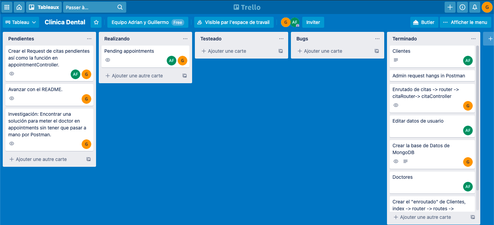
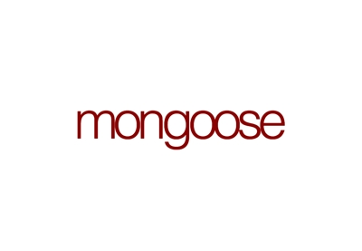

<h1 align="center">
   Data Base of a Dental CLinic (MongoDB)
</h1>

---
Challenge nº6 from the Fullstack Developer Bootcamp at <a href="https://geekshubsacademy.com/">GeeksHubs Academy</a>, where our mission is to create a backend no related database for a dental clinic application.

In this project, we have created as mentionned before, a dental clinic database that allows clients/users to create appointments and register them. These users can also choose the dentist from the collection "dentist" and add it to the collection "appointment". 

## The project is still in construction. 🔧

Starting date: June 1st 2021.  
Due date: June 8th 2021.

We have used the Trello tool so we could share the tasks between the members of the project, in order to have a better organization.

## Endpoints

- Users
   - GET /user --> Shows all the users from the dental clinic.
   - POST /user/searchid/:id --> Shows Movies by their id.
   - GET /movies/search/:title --> Shows Movies by title.
   - GET /movies/genre/:name --> Shows Movies by genre.
   - GET /movies/actors/:name --> Shows Movies by cast members.

 

- Dentists
   - GET /tvshows/toprated --> Shows the Top Rated TVShows.
   - GET /tvshows/searchid/:id --> Shows TVShows by their id.
   - GET /tvshows/search/:title --> Shows TVShows by title.
   - GET /tvshows/ontheair --> Shows TVShows that will have a new episode broadcasted in the next 7 days.
   - GET /tvshows/theatre_or_cinema/:id --> Shows TVShows that will come out in Theaters. 
 

- User Login
   - POST /login --> While login a registered user a token will be returned.
 

- Appointments
  -

Work realized by:
-[Adrian Furlan](https://github.com/adrianfurlanc),
-[Guillermo Raez](https://github.com/GuillermoRaez).
